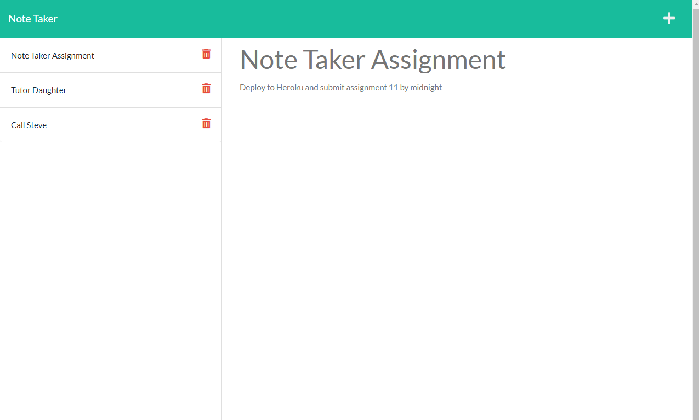
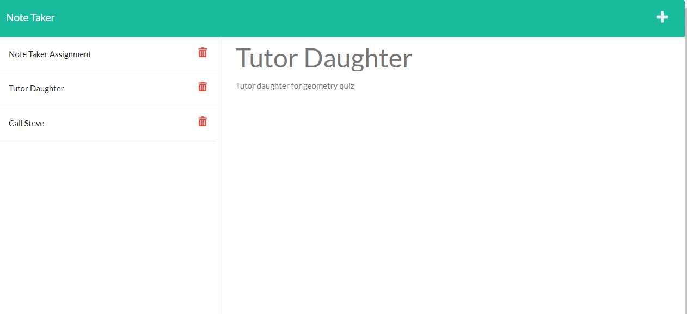

# Note Taker

## Table of contents

- [Overview](#overview)
  - [The challenge](#the-challenge)
  - [User Story](#user-story)
  - [Acceptance Criteria](#acceptance-criteria)
  - [Screenshot](#screenshot)
  - [Links](#links)
- [My process](#my-process)
  - [Built with](#built-with)
  - [What I learned](#what-i-learned)
- [Author](#author)


## Overview

### The challenge

The challenge is to create an application that can be used to write and save notes. This application uses an Express.js back end, saves and retrieves note data from a JSON file. 

### User Story

AS A small business owner
I WANT to be able to write and save notes
SO THAT I can organize my thoughts and keep track of tasks I need to complete

### Acceptance Criteria

GIVEN a note-taking application
WHEN I open the Note Taker
THEN I am presented with a landing page with a link to a notes page
WHEN I click on the link to the notes page
THEN I am presented with a page with existing notes listed in the left-hand column, plus empty fields to enter a new note title and the note’s text in the right-hand column
WHEN I enter a new note title and the note’s text
THEN a Save icon appears in the navigation at the top of the page
WHEN I click on the Save icon
THEN the new note I have entered is saved and appears in the left-hand column with the other existing notes
WHEN I click on an existing note in the list in the left-hand column
THEN that note appears in the right-hand column
WHEN I click on the Write icon in the navigation at the top of the page
THEN I am presented with empty fields to enter a new note title and the note’s text in the right-hand column

### Screenshot






### Links

- Solution URL: [Github Repo](https://github.com/Monkonjay/Note-Taker)
- Heroku Deployed Link: [Test the Project]()


## My process

### Built with

- Node.js
- Inquirer
- Express


### What I learned

The main skills demonstrated in this application include declaring routes and deploying to Heroku. 


```javaScript /Express routes
// get routes for returning all notes.
app.get('/api/notes', (req, res) => {
res.json(notes);
});
```

## Author

- Website - [Robert M Greene]( https://monkonjay.github.io/Portfolio/)
- Github - [Monkonjay](https://github.com/Monkonjay)